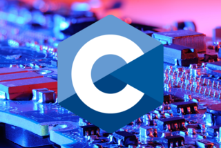

# RUN TRACK C



RunTrack openClassroom et LaPlateforme

## Table des matières

- [Installation](#installation)
- [Utilisation](#utilisation)

## Installation

1. Installation - TDM-GCC

```bash
https://jmeubank.github.io/tdm-gcc/
```

A installer sur son pc

2. Changer paramètre systeme :  
   Allez dans Paramètres > Mise à jour et securité > Paramètres de protection de virus et menaces > Gerer les paramètres > Exclusion > ajouter > Faites oui > et ajouter le dossier C de votre projet  
   **Evite que le parafeu ne se déclenche à chaque nouveau projet**

```bash
gcc test.c -o coco
```

3. Création d'un Makefile

**pour compiler :**

```bash
make
```

**pour nettoyer les fichier générés :**

```bash
make clean

```

## verification encodage UTF8

**pour mettre encodage UTF8**

Taper cela dans le terminal

```bash

 $OutputEncoding = [System.Text.Encoding]::UTF8

```

**pour le vérifier**

```bash
[Console]::OutputEncoding

```

## Contributeur

- [Florence Navet](https://github.com/florence-navet)
